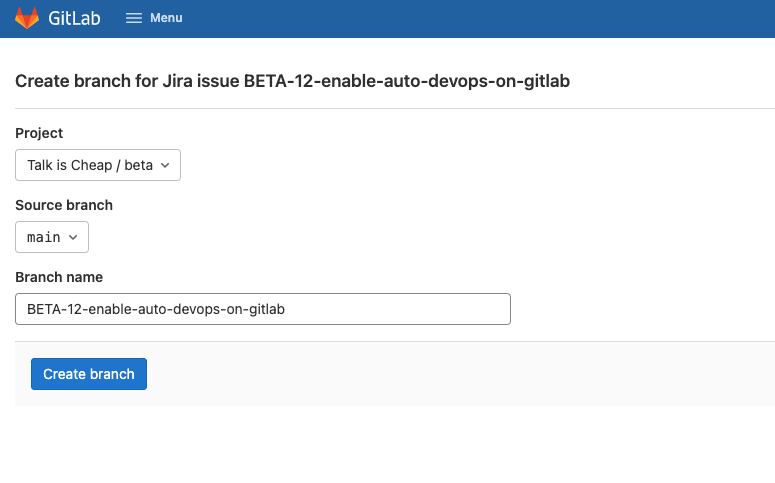

# beta

    

> DevOps is not a goal, but a never-ending process of **continuous improvement**.
>
> — Jez Humble

一个 DevOps 流水线演示项目，用于展示企业级软件交付自动化场景，提供端到端交付设计思路。本项目源于工作经验提炼和抽象，也借鉴了互联网提供的资源，欢迎大家提供反馈和指导意见。

更好的阅读体验请点击：https://talk-cheap.github.io/beta/

## 项目亮点

1. **完整的交付链：**从需求收集、需求管理、代码开发、CICD、测试、发布、运维监控都提供了相应的设计思路和实践。
2. **主流的工具栈：**本项目中所演示的工具均为业界主流工具栈，我们在这个过程中也在学习和提高。
3. **代码既是文档：**DevOps 的落地离不开文档，项目维护也离不开文档。代码即文档的理念应该得到推行。

## 项目规划

本项目大约历时 4 个月，利用大家工作之余的时间断断续续完成。就完成度来说，坦白讲并没有那么优秀，不过项目的规划图还是可以供其他同学参考。

前期的头脑风暴和知识总结我们主要使用思维导图来完成，实际工作中 xmind 也是我们使用非常频繁的工具之一，强烈推荐。

## 设计理念

本项目主要围绕着[DevOps 的 CAMS 理念模型](https://www.linkedin.com/learning/devops-foundations/devops-core-values-cams-2)实现：

- **Culture 文化**：文化包括理念讲解和宣传，包括此文档，我们都在向所有 DevOps 从业者传递有价值的信息，DevOps 不仅仅是流程和工作的改进，更是从开发和运维的意识转变，以全局优化的角度去优化软件交付流和改善研发体验。

- **Automation 自动化**：自动化是 DevOps 中重要的组成部分，我们应该尽可能地将交付过程中的工作自动化掉，在本项目中我们提供了自动化基础设施，自动化配置，自动化编译部署，自动化测试和监控等方面的实践。

- **Measurement 度量**：合理地管理和改进我们的系统的关键之一就是我们有测量它们的能力。除此之外我们还需要让开发团队感知 DevOps 工作的价值。不过指标的设计和选择需要十分谨慎，一旦对团队构成压迫将可能带来不良后果。

- **Sharing 分享**：在 DevOps 推进中，开放和透明性是合作的核心。知识共享是持续反馈和改进过程中一个重要的点，有了更多更好的分享，DevOps 才能做的更好，企业才能不断发展壮大。

## 项目架构

项目架构依据设计理念分为 3 个层次，分别是：

1. 最上层的自动化交付层，通过自动化构建完整的交付流水线。
2. 中间层的数据采集和度量服务，提供改进的思路和方向。
3. 基础层的最佳实践沉淀，作为业务团队的培训和改进的指导。

以下为本项目目录结构。

## 核心组件

| 组件名称     | 作用                                                         |
| ------------ | ------------------------------------------------------------ |
| Kubernetes   | 产品部署依赖的基础设施，腾讯云TKE服务，基于terraform自动化部署和管理   |
| Slack        | 和用户沟通的主要信息渠道，集成ChatOps功能                    |
| Jira         | 需求管理系统，用于敏捷开发的项目规划和迭代                   |
| Gitlab       | 源代码托管工具，提供一站式的DevOps服务功能，包括CICD，制品库，监控等 |
| SonarQube    | 静态代码扫描工具，本项目我们使用公有云服务                   |
| BlackDuck    | 安全漏洞扫描工具，本项目待定使用，备选方案Snyk               |
| TaaS         | 自研的自动化测试服务平台，提供测试即服务的能力，方便集成功能测试，性能测试等到CICD流水线 |
| ELK          | 中心数据仓库，提供日志监控，行为分析，报表聚合等功能，尽可能挖掘和放大ELK的价值 |
| App Dynamics | 软件性能监控和链路跟踪工具，对复杂系统和微服务架构有很大帮助。 |

!> 鉴于时间和资源限制，以上所列举组件在该项目并未完全实施，更多内容请查阅其官网进行了解。

## 最佳实践

在该项目中我们是否推荐以下 DevOps 最佳实践。

### 尽可能代码化所有东西

包括但不仅限于基础设施的构建，配置文件，部署流程，需求变更流程，项目文档。

### 让用户感知需求在交付

交付过程中的所有事件都应该被记录和归集到需求本身，作为用户可以选择去订阅需要相关的变更事件，例如需求正在测试，用户有可能愿意提前介入测试。在本项目中，我们利用 Slack 和 Jira 的深度集成来达到这个目标。

### 使用合理的分支模型

不是所有的项目都可以用同一个分支模型，一定要因地制宜，不能生搬硬套。在本项目中，我们使用了基础的分支开发，主干上线的模型就能很好满足我们的需求。

### 内建质量和测试解耦

内建质量指的是在设计之初就将验收条件考虑在内，将质量设计出来而不是测试出来。测试解耦是为了更灵活的将质量集成到任何位置，比如在 CICD 调用测试服务，在 IDE 提供测试插件。

### 可追溯的交付规范和设计

从一开始就要约定好交付规范，比如：

1. 需求必须进入 Jira 后才开始分配，而不是先开发后补需求。
2. 代码提交日志必须包含需求 ID，能自动化需求状态流转。
3. 制品打包中包含变更记录，能将版本号和需求 ID 做绑定。

### 全局指标和数据采集

项目早期的人力和经验肯定不足，度量和改进思维可能让项目变得更健康和强壮。在 DevOps 落地过程中，我们主要关注两大类指标：

- 交付速度：包括需求前置时间，部署频率，需求吞吐量等
- 交付质量：包括部署失败率，线上故障数，回滚恢复时间

## 演示场景

| 场景                                   | 人物       | 我们的方案                                               |
| -------------------------------------- | ---------- | -------------------------------------------------------- |
| 我想提出需求                           | 用户       | 登录 Slack，使用 Jira 机器人提出需求                     |
| 我想了解需求进度                       | 用户       | 登录 Slack，使用 Jira 机器人命令，或者访问 Jira 看板     |
| 我想规划产品需求和控制进度             | 产品负责人 | 登录 Jira，使用 Scrum 进行敏捷迭代，使用 Kanban 跟踪进度 |
| 我想实现代码的自动化部署，测试和监控   | 开发人员   | 登录 Gitlab，通过 CICD 界面完成所有代码交付动作          |
| 我想查看编译日志，产品运行日志         | 开发人员   | 登录 ELK，选择不同索引和报表进行相应操作                 |
| 我想查看服务调用链路，监控产品错误     | 开发人员   | 登录 AppDynamic，选择服务名称后开始调用相关指标          |
| 我想了解研发团队交付效率和 DevOps 能力 | CTO        | 登录 ELK，查看某时间段内的 DevOps 交付指标               |

## 分支模型

如下图所示，我们采用按环境隔离的分支模型来管理研发流程。

### 演示截图

#### 使用 Slack 提出用户需求

#### 在 Jira 中使用 Backlog 和看板管理需求

#### 在 Jira 中新建功能分支，开始功能开发

#### 在 IDE 完成代码后，提交代码到 Gitlab

#### 自动触发 CICD 流水线，功能经过编译测试扫描后部署到 **测试环境**

#### 开发人员使用 MR 发起合并代码请求，Code Review 后合并代码到主分支

#### 自动触发 CICD 流水线， 功能再次编译测试扫描后部署到 **生产环境**

#### 检查 Jira 变更历史，需求进度已经自动同步 Jira 并通知到 Slack

#### 功能上线后关闭 Jira 需求

#### 线上日志检查演示 - ELK

待补充。

#### 线上链路追踪演示 - AppDynamic

待补充。

## 经验教训

在进行本次项目的过程中，我们遇到过一些问题，供大家警醒：

1. 团队过于乐观：组建团队后大家以为每个人都能有足够的时间参与和保证完成度，实际上很难
2. 交付结果不确定：前期的需求调研和目标并没有很明确就开始干活，后续的结果和期望有差异
3. 知识和技能不足：本次项目设计中技术栈和系统集成和平时的工作都不太一样，需要比较多时间去掌握
4. 合作和迭代不频繁：因为成员贡献时间不一致，我们原地每周的迭代会议很难让所有人都参与，以单兵作战为主，缺乏足够的协作

## 参考资料

1. 《阿里巴巴 DevOps 实践指南 2021》
2. Gitlab 官方文档
3. Atlassian Jira 官方文档
4. ELK 官方文档

## 版权声明

本项目基于 MIT 开源，你可以在个人或者商业场景使用和修改本项目源代码。当然，如果你愿意保留来源作者和项目信息我们将不胜感激。

本项目成员名单如下：

| 成员         | 简介                                                  | 开源/博客         |
| ------------ | ----------------------------------------------------- | ----------------- |
| Toby Qin     | 资深 DevOps 工程师，喜欢和人沟通，擅长学习和分享技术  | tobyqin@github    |
| Shimin Wang  | 全栈工程师，喜欢捣鼓工具和新鲜的东西                  | sirius0301@github |
| Thyme Chen   | 测试开发工程师，擅长 Python 和数据分析                | nowu@github       |
| Xiaokang Han | 运维工程师，擅长 Kubernetes 和 Linux 服务器运维和构建 |                   |

最后，感谢你的阅读。
