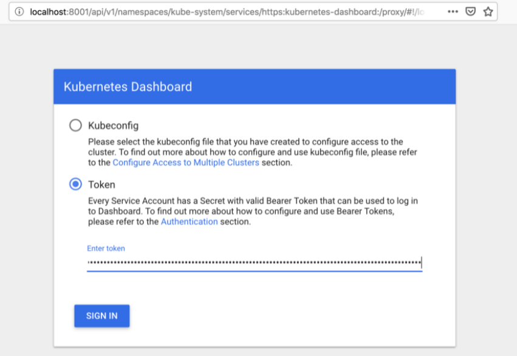
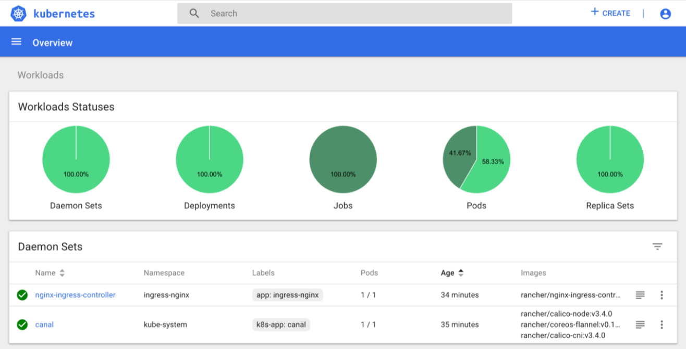

?> 在本节记录了我们配置 Kubernetes 的过程，关于 Kubernetes 本身的更多细节我们十分建议大家阅读其官方文档： https://kubernetes.io/docs/tutorials/

> 我们主要通过 Terraform 来自动化部署 Kubernetes。

## 实施步骤

1. Prepare node (virtual/bare metal machine)
2. Create project folder where the resulting files will be stored
3. Create Terraform resources in main.tf
4. Initialize Terraform, validate and apply configuration
5. Get Kubernetes Dashboard token and login

## 操作命令

```bash
$ mkdir my-k8s-cluster && cd my-k8s-cluster
$ touch main.tf

# main.tf
resource "rke_cluster" "cluster" {
  nodes {
    address = "node1.brotandgames.com"
    user    = "root"
    role    = ["controlplane", "worker", "etcd"]
    ssh_key = "${file("~/.ssh/id_rsa")}"
  }
  addons_include = [
    "https://raw.githubusercontent.com/kubernetes/dashboard/v1.10.1/src/deploy/recommended/kubernetes-dashboard.yaml",
    "https://gist.githubusercontent.com/superseb/499f2caa2637c404af41cfb7e5f4a938/raw/930841ac00653fdff8beca61dab9a20bb8983782/k8s-dashboard-user.yml",
  ]
}

resource "local_file" "kube_cluster_yaml" {
  filename = "${path.root}/kube_config_cluster.yml"
  sensitive_content  = "${rke_cluster.cluster.kube_config_yaml}"
}

# init
$ terraform init
...
* provider.local: version = "~> 1.2"
* provider.rke: version = "~> 0.11"
...
Terraform has been successfully initialized!

# validate
$ terraform validate
$ terraform plan
Refreshing Terraform state in-memory prior to plan...
...
Terraform will perform the following actions:

  + local_file.kube_cluster_yaml
      id:                         <computed>
      ...

  + rke_cluster.cluster
      id:                         <computed>
      ...


## apply
$ terraform apply
...
rke_cluster.cluster: Creation complete after 3m11s (ID: node1.brotandgames.com)
...
local_file.kube_cluster_yaml: Creation complete after 0s (ID: 4bd2da6f5c62317e16392c2a6b680f96f41bb2dc)

Apply complete! Resources: 2 added, 0 changed, 0 destroyed.

# check
$ ls
kube_config_cluster.yml    main.tf            terraform.tfstate

$ kubectl --kubeconfig kube_config_cluster.yml -n kube-system describe \
secret $(kubectl --kubeconfig kube_config_cluster.yml -n kube-system get secret\
 | grep admin-user | awk '{print $1}') | grep ^token: | awk '{ print $2 }'

$ kubectl --kubeconfig kube_config_cluster.yml proxy
Starting to serve on 127.0.0.1:8001

```





## 参考文档

- https://medium.com/@brotandgames/deploy-a-kubernetes-cluster-using-terraform-and-rke-provider-68112463e49d
