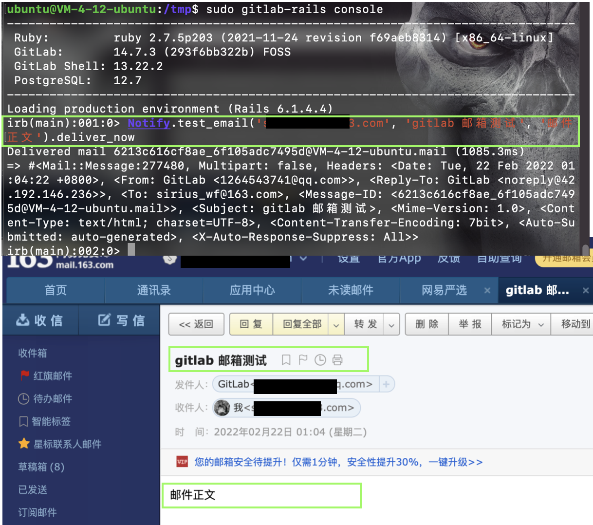

?> 本文将介绍gitlab-ce 安装与配置，Gitlab 是 CICD 的核心系统，提供了源代码版本控制和持续交付相关的所有功能。

基础环境：腾讯云轻量服务器


# 一. 安装 Gitlab-ce

## 1. 安装依赖项
```shell
sudo apt update
sudo apt install ca-certificates curl openssh-server postfix
```

**配置postfix**


## 2. 安装Gitlab-ce

```shell
cd /tmp
curl -LO https://packages.gitlab.com/install/repositories/gitlab/gitlab-ce/script.deb.sh
sudo bash /tmp/script.deb.sh
```

**配置国内加速镜像**

```shell
sudo vim /etc/apt/sources.list.d/gitlab_gitlab-ce.list
```

```txt
deb https://mirrors.tuna.tsinghua.edu.cn/gitlab-ce/ubuntu focal main
deb-src https://mirrors.tuna.tsinghua.edu.cn/gitlab-ce/ubuntu focal main
```

```shell
sudo apt update
sudo apt install gitlab-ce
```


## 3. 配置Gitlab

```shell
sudo vim /etc/gitlab/gitlab.rb
```


```txt
  32 external_url 'http://your public ip or hostname'
  80 gitlab_rails['smtp_enable'] = true
  81 gitlab_rails['smtp_address'] = "smtp.qq.com"
  82 gitlab_rails['smtp_port'] = 465
  83 gitlab_rails['smtp_user_name'] = "1264543741@qq.com"
  84 gitlab_rails['smtp_password'] = "you authorization code"
  85 gitlab_rails['smtp_domain'] = "smtp.qq.com"
  86 gitlab_rails['smtp_authentication'] = "login"
  87 gitlab_rails['smtp_enable_starttls_auto'] = true
  88 gitlab_rails['smtp_tls'] = true
  89 gitlab_rails['gitlab_email_from']='you qq account@qq.com'
  90 # gitlab_rails['smtp_pool'] = false
```

重载配置

```shell
sudo gitlab-ctl reconfigure
```

**配置个人QQ邮箱作为Gitlab邮箱，请参照如下文档**
[记一次gitlab添加用户收不到邮件的解决办法](https://cloud.tencent.com/developer/article/1111933)


## 4. 配置Gitlab 管理员账户密码

```shell
sudo gitlab-rails console
u=User.find(1)
u.password='your root password'
u.save!
exit
sudo gitlab-ctl restart
```


## 5. 测试邮箱配置

```shell
sudo gitlab-rails console

Notify.test_email('deliver to', 'gitlab 邮箱测试', '邮件
正文').deliver_now
```



## 6. 参考资料

- [Ubuntu 20.04安装配置GitLab](https://blog.csdn.net/qq_35844177/article/details/106876923)
- [GitLab服务器修改管理员用户root密码](https://blog.csdn.net/w544924116/article/details/118876468)
- [记一次gitlab添加用户收不到邮件的解决办法](https://cloud.tencent.com/developer/article/1111933)

# 二. 安装与配置 Gitlab-Runner

Gitlab-Runner 安装环境：

## 1. 安装 Gitlab-Runner

首先信任Gitlab的GPG公钥：

```shell
curl https://packages.gitlab.com/gpg.key 2> /dev/null | sudo apt-key add - &>/dev/null
```

其次，配置清华大学开源镜像站，将如下内容写进 `/etc/apt/sources.list.d/gitlab-runner.list`

```shell
deb https://mirrors.tuna.tsinghua.edu.cn/gitlab-runner/ubuntu bionic main
```

最后安装 `gitlab-runner`

```shell
sudo apt-get update
sudo apt-get install gitlab-runner
```

## 2. 配置 Gitlab-Runner

首先注册 Gitlab-Runner

```shell
sudo gitlab-runner register
```


其次，重启 Gitlab-Runner

```shell
sudo systemctl restart gitlab-runner
```
## 3. 参考文档

- [One-line registration command](https://docs.gitlab.com/runner/register/)
- [Gitlab Runner 镜像使用帮助](https://mirrors.tuna.tsinghua.edu.cn/help/gitlab-runner/)

Gitlab 本身提供了良好的文档供我们参考，在和其他系统集成时，我们可以参考这些文档。

- https://docs.gitlab.com/ee/integration/

在本项目中我们将 Gitlab 集成了以下系统：

1. Slack：用于通知 CICD 信息
2. Jira： 用于同步需求交付状态
3. Email: 用于邮件通知 CICD 信息
